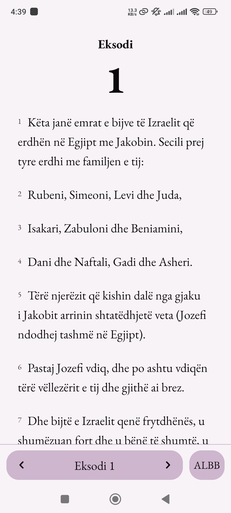
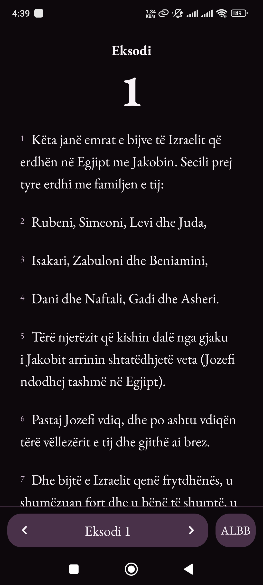
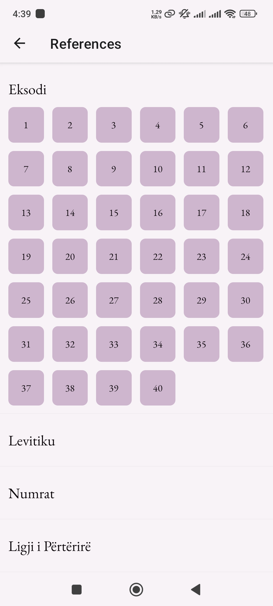
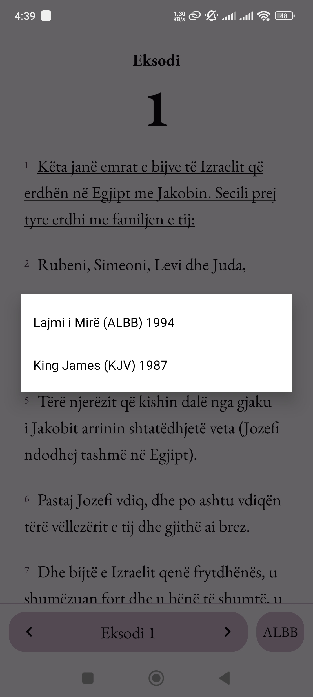
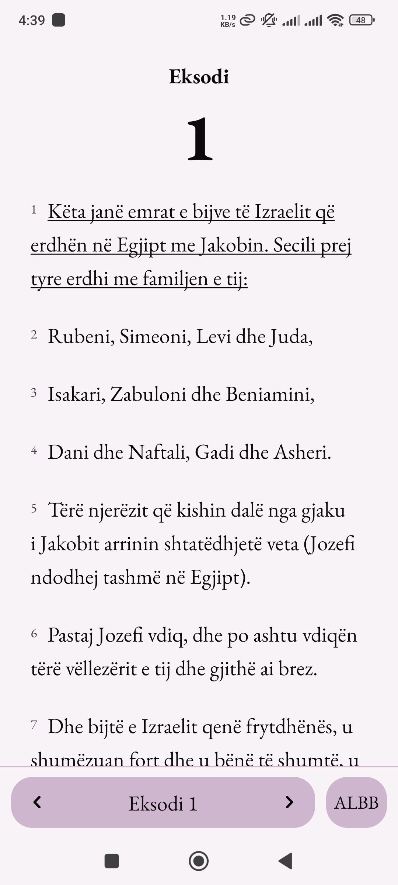
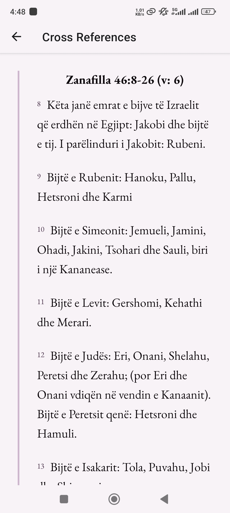

# Biblike(1.1.4)

A minimalistic offline Bible reading mobile application, built with:

- React Native
- Expo (SDK 52)
- SQLite3

### Features

- Light/dark mode.
- Cross-references (Tap a verse to select and underline it, tap it another time to show the hidden view).

### Bible Versions

- Lajmi i Mire 1994 - ALBB (shqip)
- King James 1987 - KJV (english)

### Preview (Android)

  
  
  
  
  
  

## Usage

- You can find a pre-built preview `.apk` with eas cli for personal use [here](./builds).
- **IMPORTANT**: Before uninstalling or updating the application, clear data to remove the database.
